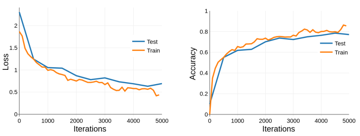
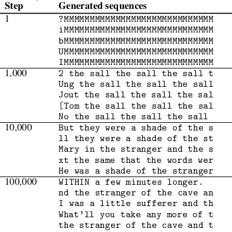
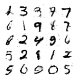

### Deep Learning @ UvA

This repository contains work for the Deep Learning course, part of the [master's program](<https://www.uva.nl/en/programmes/masters/artificial-intelligence/artificial-intelligence.html>) in Artificial Intelligence at the University of Amsterdam.

**Assignment 1:** MLPs, CNNs and Backpropagation

**Assignment 2:** Recurrent Neural Networks and Graph Neural Networks

**Assignment 3:** Variational Autoencoders, Generative Adversarial Networks, and Normalizing Flows

